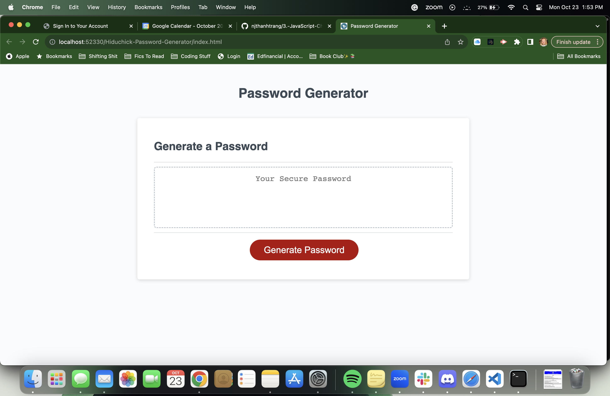
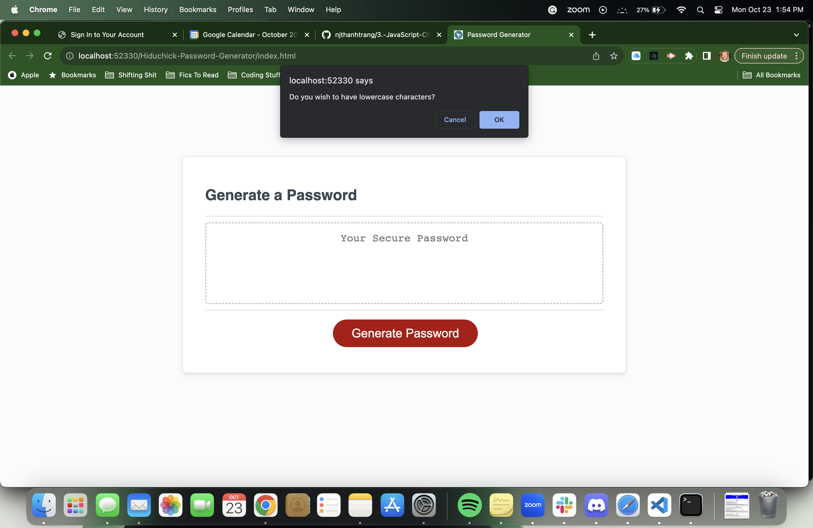
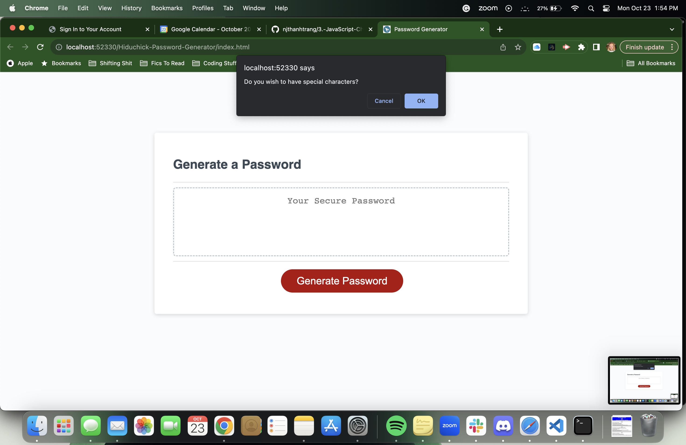
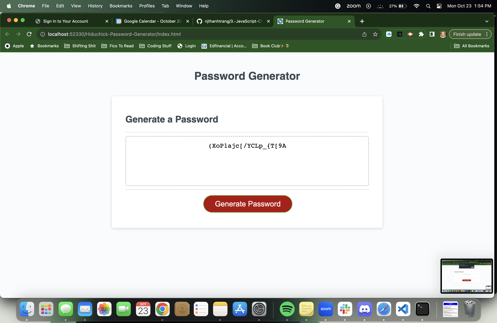

# Hiduchick-Password-Generator

## Description
Randomly generated passwords can provide greater security for sensitive data. HTML is used to markup the structure, CSS to style content, and JavaScript to program the functional behavior of this website to generate a random password after gathering user inputs through a series of prompts for password preferences. Specific criteria for the password include having a length of 8-128 characters, lowercase, uppercase, numeric, and/or special character types, for each prompt to be validated after selection, and for the generated password that matches the selected criteria to be displayed on the page. In the future, we may look into reworking the prompts into checkbox selections to improve user experience.

## Usage
1. Open the password generator URL in your browser.
2. Generate a random password by clicking the "Generate Password" button and following the prompts.

## Installation

1. Clone the repo
   git clone https://github.com/dhiduchick/Hiduchick-Password-Generator.git

2. Open in VS Code. If you do not have VS code you must install it.

## Built With
* HTML
* CSS
* JavaScript

## Website

https://dhiduchick.github.io/Hiduchick-Password-Generator/

## Images 

# Author 
Daelyn Hiduchick